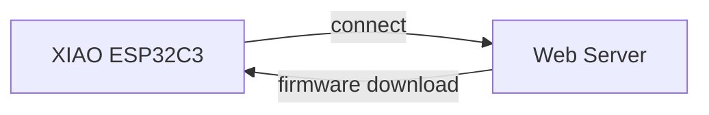
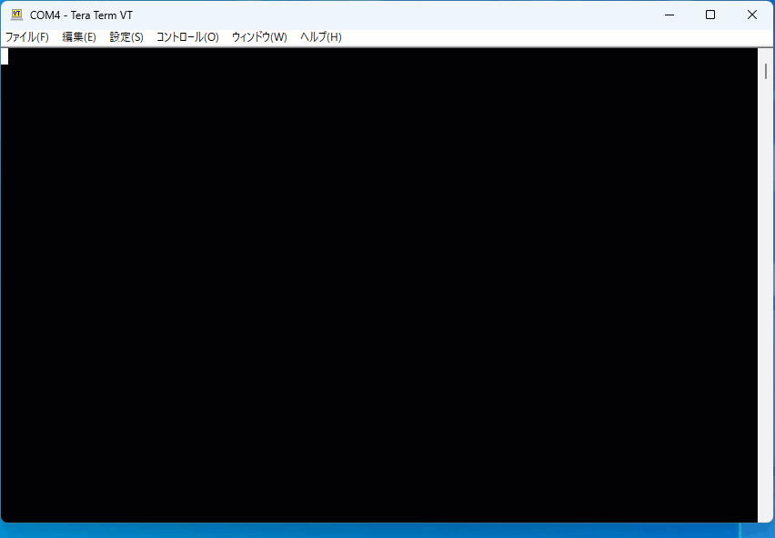

[Japanese]

# HttpsOTA

HttpsOTAは、Webサーバー[www.seeed.co.jp](https://www.seeed.co.jp/)に置いたファームウェアでXIAO ESP32C3のファームウェアをアップデートするサンプルコードです。

1. XIAO ESP32C3が起動するとシリアルポートに現在実行しているファームウェアのパーティション情報を表示します。
2. XIAO ESP32C3をリセットして、すぐにBOOT BUTTONを押し続けてください（リセット後1秒以内にボタンを押して、2秒以上押し続ける）。
3. XIAO ESP32C3がファームウェアアップデートモードに入ります。
4. XIAO ESP32C3がWebサーバーに接続してファームウェアをダウンロードしてファームウェアを書き換え後、再起動します。
5. XIAO ESP32C3が起動するとシリアルポートに現在実行しているファームウェアのパーティション情報を表示します。

## コード内のパラメータ

| パラメータ名 | 説明 |
| :--- | :--- |
| `WIFI_SSID` | 接続するWi-FiアクセスポイントのSSIDです。デバイスに記憶しているSSID/パスフレーズを使うときは空を指定します。 |
| `WIFI_PASSPHRASE` | 接続するWi-Fiアクセスポイントのパスフレーズです。 |
| `FIRMWARE` | ファームウェアのURLです。 |

## ライセンス

[MIT](LICENSE.txt)
