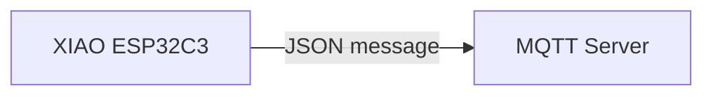

[Japanese]

# MqttsMutualPubClient

MqttsMutualPubClientは、一定時間間隔にMQTTサーバー[test.mosquitto.org](https://test.mosquitto.org/)にJSONメッセージをパブリッシュ（送信）するサンプルコードです。



## コードの変更

MqttsPubClientのTcpClientにクライアント証明書とクライアントプライベートキーを設定します。

```cpp
	Serial.println("TCP: Configure.");
	TcpClient.setCACert(CA_CERT);
	TcpClient.setCertificate(CLIENT_CERT);
	TcpClient.setPrivateKey(CLIENT_PRIVKEY);
```

## MQTTメッセージのモニタリング

```
$ mosquitto_sub -h <hostname> -p 8884 --capath . --cafile ca.crt  --cert client.crt --key client.key -t "dt/mqtts-pub-client/test/#" -v -q 2
```

## MQTTサーバーのセットアップ

> 参考：[演習 - プライベート MQTT ブローカーを配置する](https://docs.microsoft.com/ja-jp/learn/modules/altair-azure-sphere-deploy-mqtt-broker/03-exercise-set-up)

```
sudo apt update && sudo apt -y upgrade
sudo apt install -y mosquitto mosquitto-clients

mkdir -p ~/mosquitto_certs && cd ~/mosquitto_certs

openssl req -new -x509 -days 730 -nodes -extensions v3_ca -keyout ca.key -out ca.crt

openssl genrsa -out server.key 2048 && \
openssl req -new -out server.csr -key server.key -subj "/CN=$CommonName" && \
openssl x509 -req -in server.csr -CA ca.crt -CAkey ca.key -CAcreateserial -out server.crt -days 730 && \
openssl rsa -in server.key -out server.key

openssl genrsa -out client.key 2048 && \
openssl req -new -out client.csr -key client.key -subj "/CN=$CommonName" && \
openssl x509 -req -in client.csr -CA ca.crt -CAkey ca.key -CAcreateserial -out client.crt -days 730 && \
openssl rsa -in client.key -out client.key

sudo chmod a+r *.key

sudo cp ca.crt /etc/mosquitto/ca_certificates &&
sudo cp server.crt /etc/mosquitto/ca_certificates &&
sudo cp server.key /etc/mosquitto/ca_certificates

sudo sh -c "cat > /etc/mosquitto/conf.d/default.conf" << 'EOL'
per_listener_settings true

listener 1883 localhost
allow_anonymous true

listener 8884
allow_anonymous false
cafile /etc/mosquitto/ca_certificates/ca.crt
keyfile /etc/mosquitto/ca_certificates/server.key
certfile /etc/mosquitto/ca_certificates/server.crt
require_certificate true
use_identity_as_username true
tls_version tlsv1.2
EOL

sudo systemctl enable mosquitto && sudo systemctl start mosquitto
```

## ライセンス

[MIT](LICENSE.txt)
