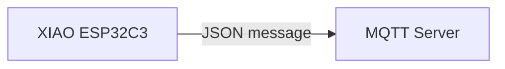
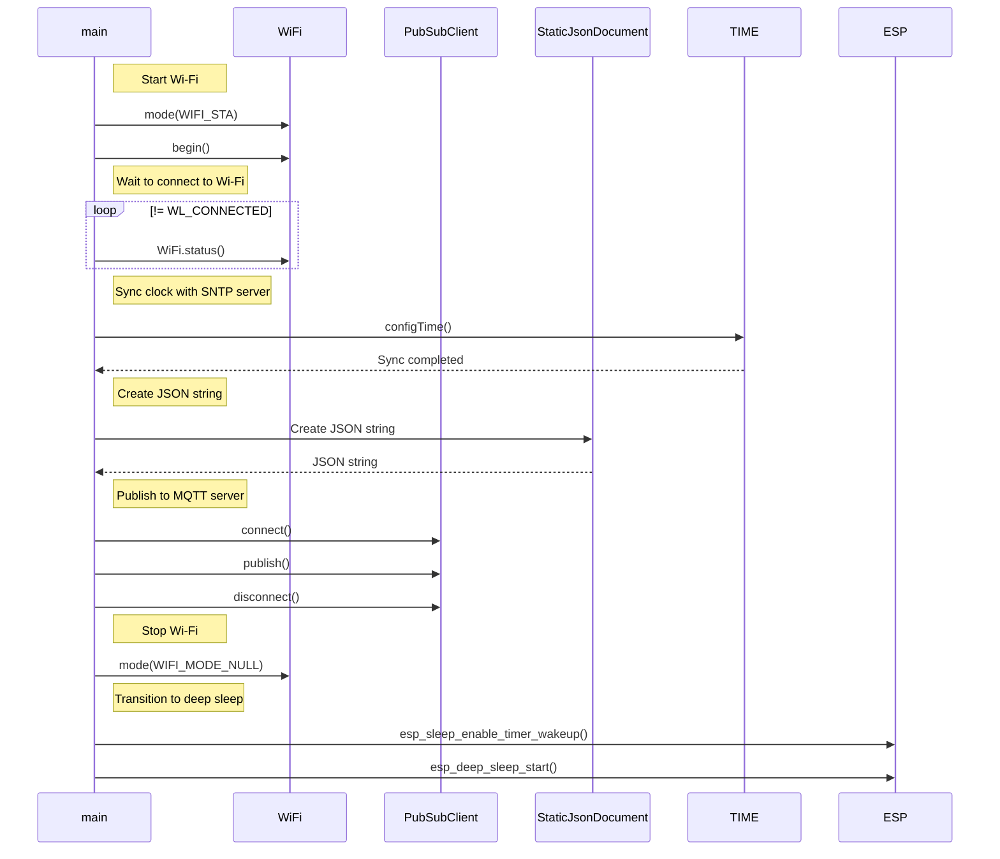

[Japanese]

# MqttsPubClient

MqttsPubClientは、一定時間間隔にMQTTサーバー[test.mosquitto.org](https://test.mosquitto.org/)にJSONメッセージをパブリッシュ（送信）するサンプルコードです。



## コード内のパラメータ

| パラメータ名 | 説明 |
| :--- | :--- |
| `APPLICATION_NAME` | パブリッシュするトピック名に使います。 |
| `GROUP_NAME` | パブリッシュするトピック名に使います。 |
| `DEVICE_NAME` | MQTT接続時のクライアントIDと、パブリッシュするトピック名に使います。 |
| `INTERVAL` | MQTTサーバーにパブリッシュする時間間隔です。（単純に、送信後の待ち時間として使うため、実際にパブリッシュする時間間隔は指定した値よりも長くなります。 |
| `WIFI_SSID` | 接続するWi-FiアクセスポイントのSSIDです。デバイスに記憶しているSSID/パスフレーズを使うときは空を指定します。 |
| `WIFI_PASSPHRASE` | 接続するWi-Fiアクセスポイントのパスフレーズです。 |
| `MQTT_SERVER` | MQTTサーバー名です。 |
| `MQTT_SERVER_PORT` | MQTTサーバーに接続するポート番号です。 |

## トピック名とペイロード

### 一定時間間隔にパブリッシュ

* トピック名
  * dt/`APPLICATION_NAME`/`GROUP_NAME`/`DEVICE_NAME`/uptime
* ペイロード
  * {"uptime":`Uptime`,"rssi":`Wi-Fi RSSI`}

## MQTTメッセージのモニタリング

```
$ mosquitto_sub -h test.mosquitto.org -t "dt/mqtts-pub-client/test/#" -v
```

## シーケンス



## ライセンス

[MIT](LICENSE.txt)
