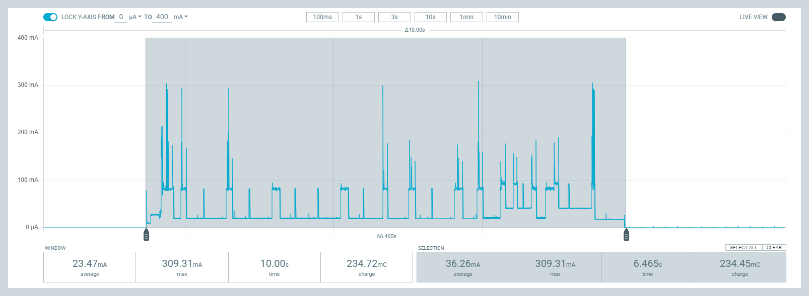

[Japanese]

# MqttsPubClientLP

MqttsPubClientLPは、一定時間間隔にMQTTサーバー[test.mosquitto.org](https://test.mosquitto.org/)にJSONメッセージをパブリッシュ（送信）するサンプルコードです。


## コード内のパラメータ

| パラメータ名 | 説明 |
| :--- | :--- |
| `APPLICATION_NAME` | パブリッシュするトピック名に使います。 |
| `GROUP_NAME` | パブリッシュするトピック名に使います。 |
| `DEVICE_NAME` | MQTT接続時のクライアントIDと、パブリッシュするトピック名に使います。 |
| `INTERVAL` | MQTTサーバーにパブリッシュする時間間隔です。 |
| `WIFI_SSID` | 接続するWi-FiアクセスポイントのSSIDです。デバイスに記憶しているSSID/パスフレーズを使うときは空を指定します。 |
| `WIFI_PASSPHRASE` | 接続するWi-Fiアクセスポイントのパスフレーズです。 |
| `MQTT_SERVER` | MQTTサーバー名です。 |
| `MQTT_SERVER_PORT` | MQTTサーバーに接続するポート番号です。 |

## トピック名とペイロード

### 一定時間間隔にパブリッシュ

* トピック名
  * dt/`APPLICATION_NAME`/`GROUP_NAME`/`DEVICE_NAME`/uptime
* ペイロード
  * {"uptime":`Uptime`,"rssi":`Wi-Fi RSSI`}

## MQTTメッセージのモニタリング

```
$ mosquitto_sub -h test.mosquitto.org -t "dt/mqtts-pub-client-lp/test/#" -v -q 2
```

## シーケンス


## 消費電流

| 処理 | 電気量[mC] | 電流[mA] | 時間[msec.] |
| :--- | ---: | ---: | ---: |
| MQTT通信 1回目（SNTPあり） | 234.45 | 36.26 | 6465 |
| MQTT通信 2回目（SNTPなし） | 141.25 | 45.46 | 3107 |
| ディープスリープ | 7.26 | 0.13 | 56710 |

**全体（MQTT通信を2回）:**  


**初回通信時（SNTP時刻同期あり）:**  


**2回目通信時（SNTP時刻同期なし）:**  


**ディープスリープ時:**  


## ライセンス

[MIT](LICENSE.txt)
