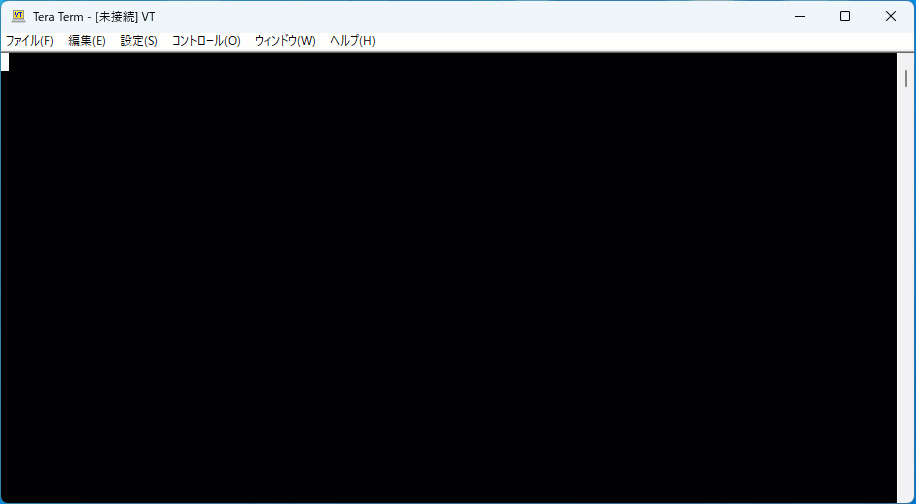

[Japanese]

# SmartConfig

SmartConfigは、Wi-FiアクセスポイントのSSIDとパスフレーズをスマートフォンからXIAO ESP32C3に設定するサンプルコードです。

1. XIAO ESP32C3をリセットして、すぐにBOOT BUTTONを押し続けてください（リセット後1秒以内にボタンを押して、2秒以上押し続ける）。
2. XIAO ESP32C3がプロビジョニングモードに入り、SmartConfigが起動します。
3. スマートフォンのESPTouchアプリから、Wi-FiアクセスポイントのSSIDとパスフレーズを送信してください。
4. XIAO ESP32C3が受信したWi-Fiアクセスポイント情報を使ってWi-Fiアクセスポイントに接続します。

## ESPTouchアプリ

* [ESP-TOUCH for iOS](https://apps.apple.com/app/espressif-esptouch/id1071176700)
* [ESP-TOUCH for Android](https://github.com/EspressifApp/EsptouchForAndroid/releases/latest)

## コード内のパラメータ

| パラメータ名 | 説明 |
| :--- | :--- |
| `SMARTCONFIG_PROTOCOL` | SmartConfigのプロトコルです。SC_TYPE_ESPTOUCH, SC_TYPE_ESPTOUCH_V2のいずれかを指定します。 |
| `SMARTCONFIG_CRYPT_KEY` | ESPTouch v2の共通鍵です。`SMARTCONFIG_PROTOCOL`にSC_TYPE_ESPTOUCH_V2と指定したときに使用します。必ず16文字にしてください。 |

## 参照リンク

* [SmartConfig](https://docs.espressif.com/projects/esp-idf/en/latest/esp32c3/api-reference/network/esp_smartconfig.html)
* [smartconfig Example](https://github.com/espressif/esp-idf/tree/master/examples/wifi/smart_config)
* [ESP-TOUCH for iOS Source Code](https://github.com/EspressifApp/EsptouchForIOS)
* [ESP-TOUCH for Android Source Code](https://github.com/EspressifApp/EsptouchForAndroid)

## ライセンス

[MIT](LICENSE.txt)
